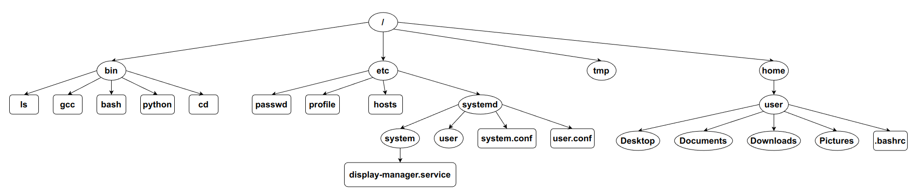
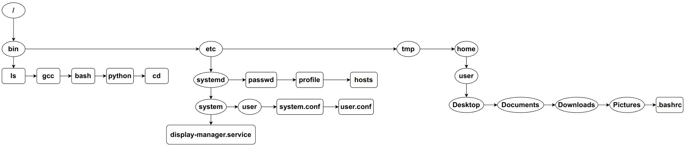
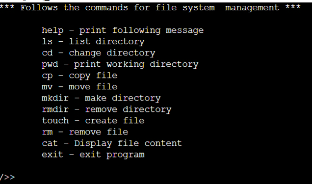
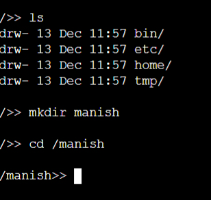
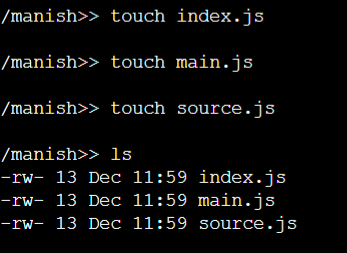
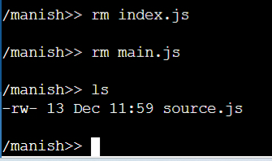
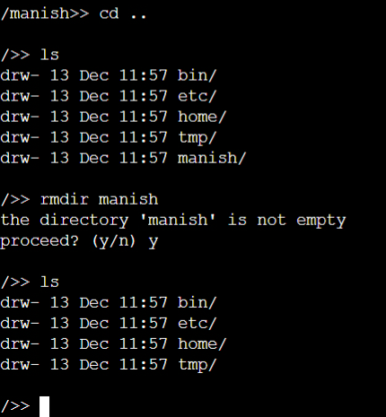

# INITO { IN-File Management System }


##  assessment solution overview

 On every Operating System  data is stored in a tree like structure( hierarchical) file system
 of directories and subdirectories. A IN-File 
management system is the program used to arrange/manage these files, move them,
and create them.....etc. it takes care of how the files are organized in system.

## Selection of Data Structure:

Trees are the best suitable data structure to implement this because
nodes and leaves of the tree resemble the directories and
sub-directories containing files in them.

**why tree ?? why not binary tree???....**

A binary tree cannot do the job here as it restricts to only having two
children. N-ary Tree should be implemented solve this. Since we do not
know what will be the value of n, each node cannot have a fixed child
links.



But if we think that  keeping the contents of a directory as a linked
list and only storing the first child’s address, then each node can have
exactly 2 links. This makes it possible to use algorithms of Binary Tree
as well.



There is also a need to traverse upwards to its root. This can be solved
by creating another link with the parent directory. Although this
technically becomes a Graph, but implementation will be like a binary
tree in a broad level and like linked list in a directory level.

<!--  -->

## Solution:

The solution is  inspired from Linux shell that has some commands to manage these  file oprations.... The program
resembles the shell which contains the present working directory on left
and prompt at end. The user can use following commands just like these commands in terminal of computers. 
 key commands are:

-   **cd** - to navigate through directories

-   **ls** - to list the files and sub-directories in a directory

-   **mkdir** – to create a new directory

-   **touch** – to create a new file

-   **rm** / **rmdir** – to remove a file / directory respectively

-   **cp** / **mv** – to copy / move a file or directory respectively


## Algorithms

**Structure of a node**:

>string name <br />
list<string> content <br />
char type <br />
string create_time <br />
string modify_time <br />
int perm <br />
node pointer link <br />
node pointer child <br />
node pointer parent <br />

**n** = Total number of nodes ; **m** = number of nodes in a directory ; **h** = height of tree

---
### ls(node=pwd->child)
This algorithm(pseudo code flow) prints all node name in a directory or give list of all these nodes
```
START
1.  if (node in not null)
    print name
    print_ls(node->link)
    end if
STOP
```
> Time Complexity = O(m) <br />
Auxiliary Space = O(1)

---
### pwd_str(root, pwd) 
This algorithm(pseudo code flow) returns the complete path of a node with respect to root  (in string from five path)
```
START 
1.  set path to empty string 
2.  if  (pwd is root)
        return “/”
	end if
3.  loop (while pwd is not root)
        set path to “/”+name+path
        set pwd to pwd->parent
	end loop
4.  return path
STOP
```
> Time Complexity = O(h) <br />
Auxiliary Space = O(h)

---
### cd(root, pwd, path)
This algorithm(pseudo code flow) returns the directory of desired path with respect to root or pwd ( working from both '.' and '..' commands also)
```python
START
1.  set path_list to split(path, '/')
2.  if (path_list[0] is empty string)
        set node to root
        pop first element from path_list
    else if (path_list[0] = ".")
        if (length of path_list is 1)
            return pwd
        else
            set node to pwd
            pop first element from path_list
        end if
    else if (path_list[0] = "..")
        if (length of path_list is 1)
            return pwd->parent
        else
            set node to pwd->parent
            pop first element from path_list
    else
        set node to pwd
    end if
3.  loop (for each element in path_list)
        set node to find_on_pwd(node, element)
        if (node is not null or node is not a directory)
            print path does not exist
            return null
        end if
    end loop
4.  return node   
STOP
```
> Time Complexity = O(m*h) <br />
Auxiliary Space = O(h)

---
### create_mkdir(root, pwd, path, type)

This algorithm(pseudo code flow) creates and returns a new node of the given path and type
```python
START
1.  get parent_path and name from path
2.  set new_pwd to cd(root, pwd, parent_path)
3.  if (new_pwd is null)
        print parent_path does not exist
        return null
    end if
4.  set node to find_on_pwd(new_pwd, name)
5.  if (new_pwd is not null)
        print path already exists
        if (do not want to overwrite) return null
        remove(root, new_pwd, name)
    end if
6.  set node to new TreeNode(new_pwd, name)
7.  set node->type to type
8.  set node->parent to new_pwd
9. set temp to new_pwd->child
10. if (temp is null)
        temp = node
        return node
    end if
11. loop (while temp->link is not null)
        temp = temp->link
    end loop
12. temp->link = node
13. return node
STOP
```
> Time Complexity = O(m*h) <br />
Auxiliary Space = O(1)

---
### remove_rm(root, pwd, path)
This algorithm (pseudo code flow) removes the node of given path
```python
START
1.  set node to find_node(root, pwd, path)
2.  if (node is null)
        print path does not exist
        return
    end if
3.  if (node is not empty directory)
        print path is not empty
        if (not want to proceed) return
    end if
4.  set temp to node->parent->child
5.  if (temp is node)
        temp = node->link
        return
    end if
6.  loop (while temp->link is not null)
        temp = temp->link
7.  temp->link = node->link
STOP
```
> Time Complexity = O(m*h) <br />
Auxiliary Space = O(1)


---
### cat(root, pwd, path)
This algorithm(pseudo code flow) displays the contents of the file in given path
```python
START
1.  set node to find_node(root, pwd, path)
2.  if (node is null)
        print path does not exist
        return
    end if
3.  if (node is not file)
        print path is not a file
        return
    end if
4.  if (node does not have read permission)
        print path does not have read permission
        return
    end if
5.  loop (for each line in node->content) print line
STOP
```
> Time Complexity = O(m*h) <br />
Auxiliary Space = O(1)
>
 # To Run / Test the program 
Copy the code from github repo (inito_project.cpp) file .
Paste it on online C++ compiler for best expirence 
**https://www.onlinegdb.com/online_c++_compiler**<br />
**https://www.tutorialspoint.com/compile_cpp_online.php**


# Outputs Of Programme
**output response of these commands on terminal**<br />






---
**Made with ❤️ By Manish Kumar Kumawat**<br />
**email::manishfte@gmail.com, 120EE0476@nitrkl.ac.in**<br />
**contactno. 9571561104**
**RollNo. 120EE0476**

